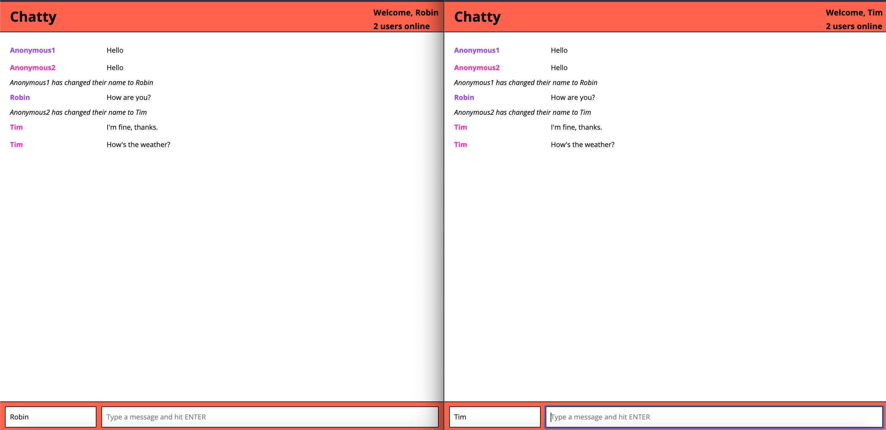

ChattyApp
=====================
A real time chat app built with React, Babel and Webpack on the front-end. Uses Websockets, node.js, Express and uuid on the server-side. The app allows users to chat anonymously or enter their name. Users are assigned one of four colors upon connecting. The app also displays the number of people currently connected. 

## Screenshot

### Dependencies

* React
* Webpack
* [babel-loader](https://github.com/babel/babel-loader)
* [webpack-dev-server](https://github.com/webpack/webpack-dev-server)

### Getting started

* Clone this repo
* npm install in the main folder and in the chatty_server folder
* run both servers in those folders with npm start

